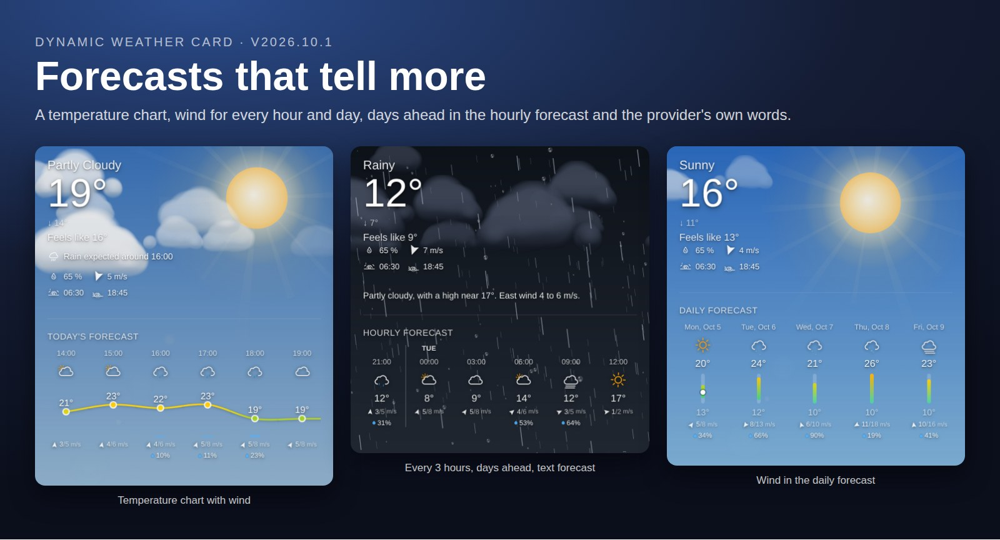
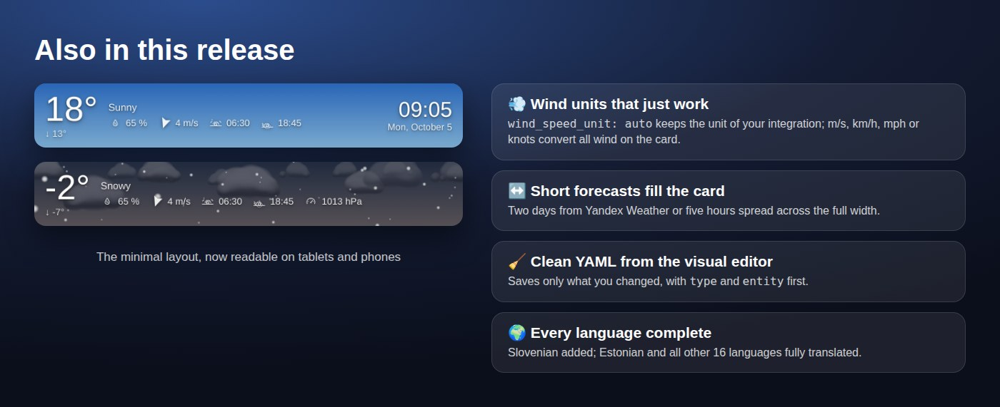
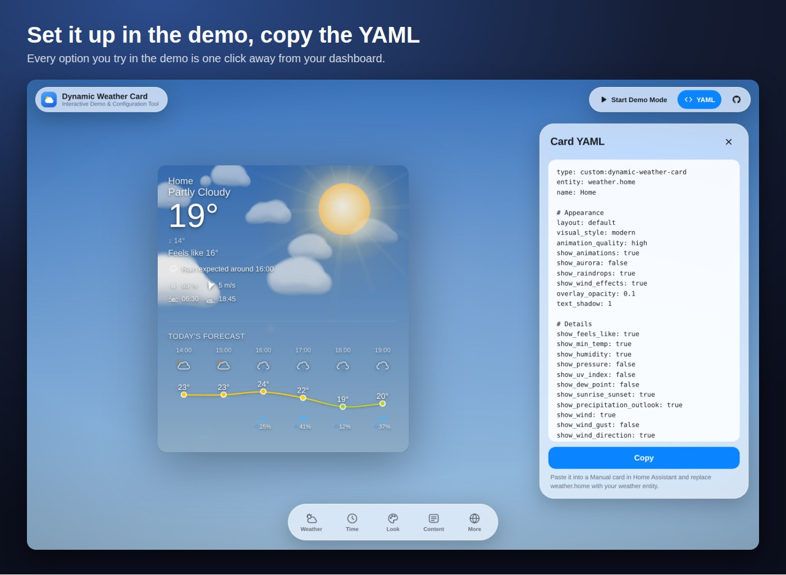

<!--
  Release highlights: shown above the changelog of the next release.
  The Release workflow adds this file to the release notes only when something in
  docs/release-highlights/ changed since the previous release, and rewrites the
  relative image links to files pinned to the release tag.
  For the next big release, replace the text and images here.
  A "codename: ..." line in this comment becomes part of the release title.
-->

## 📈 Forecasts that tell more

The last release gave the card a new sky. This one is about the forecast: what the weather will do over the next hours and days, at a glance.

| Option | What it does |
|---|---|
| `hourly_forecast_chart` | The hourly temperatures as a smooth curve colored by temperature, with the chance of precipitation as bars under it |
| `show_forecast_wind` | Wind direction, speed and gusts for every hour and day, when your integration reports them |
| `hourly_forecast_hours` | No 24-hour limit anymore: `72` shows three days, `168` a week. Each new day is labeled in the strip |
| `hourly_forecast_step` | Every few hours instead of every hour, e.g. `3` for 00:00, 03:00, 06:00 … Each entry shows the highest chance of rain of its hours |
| `show_forecast_description` | The provider's own text forecast, e.g. *"Partly sunny, with a high near 75."* (mainly the US National Weather Service) |

All of them are off by default, apart from the hour limit, and all are in the visual editor.

## ✨ Also in this release

- **Minimal layout you can read.** Bigger temperature, condition, details and clock.
- **Short forecasts fill the card.** With two days from Yandex Weather, or a few hours, the forecast spreads across the full width instead of hugging the left edge.
- **Wind units that just work.** `wind_speed_unit` now has `auto` (the default), and `ms`, `kmh`, `mph` and `kn` convert all wind on the card, forecasts included. Speeds and gusts are rounded the same way.
- **Clean YAML from the visual editor.** It saves only what you changed, with `type` and `entity` first, instead of every option with its default.
- **Readable chance of precipitation** on light daytime skies.
- **Every language complete.** Slovenian is new, and Estonian and all other languages are fully translated.
- **Fixes.** Forecasts keep updating after switching dashboard views, and the card bundle is about 70 KB smaller.

## 🎛️ Set it up in the demo, copy the YAML

The **YAML** button in the [demo](https://teuchezh.github.io/dynamic-weather-card/demo.html) shows the card you set up there as YAML, ready to paste into a manual card.

> **Upgrading:**
> - **Wind units.** The previous visual editor saved `wind_speed_unit: ms` into every card it created. That setting now converts all wind to m/s, so a card whose integration reports km/h will switch to m/s. To keep your integration's unit, pick **Auto** for the wind speed unit in the editor, or remove the line.
> - After updating, refresh the browser cache (Ctrl+Shift+R) or clear the frontend cache in the companion app.

🇷🇺 Кратко по-русски

- **Прогнозы:**
  - `hourly_forecast_chart`: график почасовой температуры, окрашенный по температуре, со столбиками вероятности осадков;
  - `show_forecast_wind`: направление, скорость и порывы ветра для каждого часа и дня;
  - `hourly_forecast_hours` больше не ограничен 24 часами: `72` — три дня, у каждого нового дня есть подпись;
  - `hourly_forecast_step`: прогноз раз в несколько часов, например `3` — 00:00, 03:00, 06:00…;
  - `show_forecast_description`: текстовый прогноз поставщика погоды (в основном метеослужба США).
- **Ещё:**
  - крупный текст в компактной раскладке;
  - короткий прогноз (например, 2 дня Яндекса) растягивается на всю ширину;
  - единицы ветра: `wind_speed_unit: auto` по умолчанию, а `ms`, `kmh`, `mph`, `kn` переводят весь ветер на карточке;
  - визуальный редактор сохраняет только изменённые опции;
  - кнопка **YAML** в [демо](https://teuchezh.github.io/dynamic-weather-card/demo.html);
  - все переводы полные, добавлен словенский.
- ⚠️ **При обновлении.** Старый редактор записывал в карточки `wind_speed_unit: ms`. Теперь эта настройка переводит ветер в м/с. Чтобы оставить единицы интеграции (например, км/ч у Яндекса), выберите в редакторе «Авто» или удалите строку.

---
