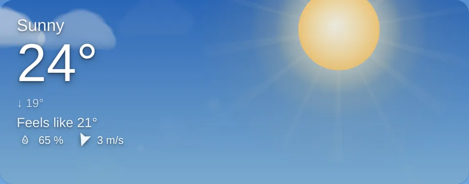
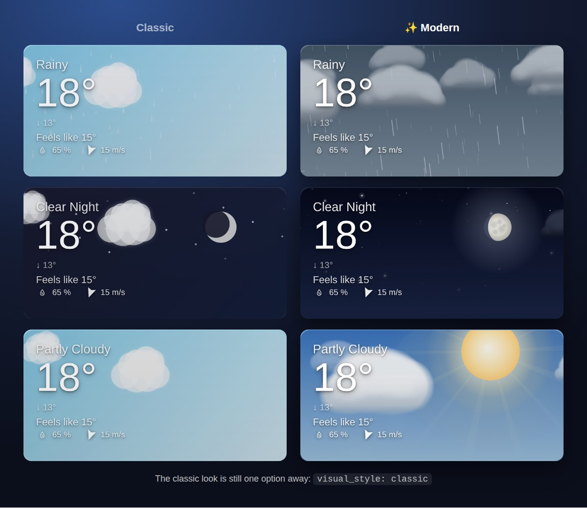
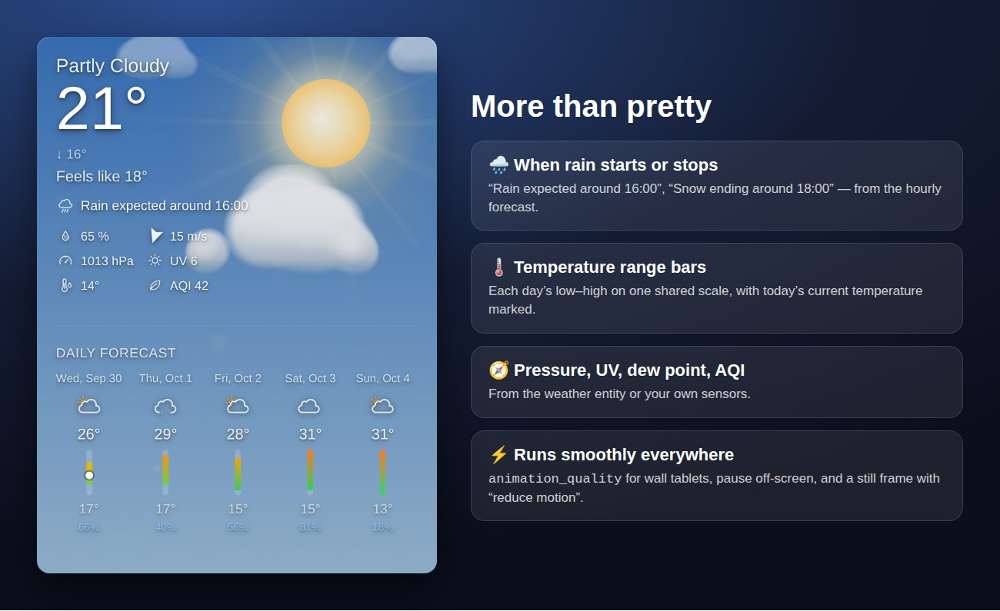

<!--
  Release highlights: shown above the changelog of the next release.
  The Release workflow adds this file to the release notes only when something in
  docs/release-highlights/ changed since the previous release, and rewrites the
  relative image links to files pinned to the release tag.
  For the next big release, replace the text and images here.
  The codename below becomes part of the release title.

  codename: Autumn Flare-Up
-->

## 🍂 Autumn Flare-Up: a whole new sky

This is the biggest visual update to Dynamic Weather Card so far, so we gave it a codename. The sky now follows the weather and the time of day. Clouds drift in layers and rain and snow have depth. At night you get stars, the moon in its real phase and, if you like, the northern lights.

- **Weather-aware sky.** Each condition has its own palette, with warm sunrise and sunset horizons that fade under heavy clouds. The sky transitions smoothly when the weather changes.
- **Layered clouds.** Soft clouds drift at three depths. Their color and coverage follow the weather.
- **Rain, snow, hail and fog with depth.** Rain splashes, snowflakes sway, hail bounces and fog banks drift.
- **Raindrops on the glass.** In the rain, drops land on the card and dry up, and bigger ones slide down leaving a trail.
- **Wind.** Windy weather gets gusts and tumbling autumn leaves, and clouds drift faster as the wind picks up.
- **Night sky.** Twinkling stars, occasional shooting stars and the moon in today's real phase.
- **Northern lights.** Waving aurora curtains on clear nights, enabled with `show_aurora: true`.
- **Sun rays** and a subtle lens flare on clear days.

### Before and after

The new graphics are the default. To keep the previous look, set `visual_style: classic`.

## 📊 More than pretty

All of these are off by default. Turn them on in the visual editor or in YAML:

| Option | What it shows |
|---|---|
| `show_precipitation_outlook` | When rain or snow starts or stops in the next 12 hours, e.g. *"Rain expected around 16:00"* |
| `show_temperature_bars` | Each day's low–high range as a colored bar on one scale, with today's temperature marked |
| `show_pressure`, `show_uv_index`, `show_dew_point` | Pressure, UV index and dew point, from the weather entity or your own sensors |
| `aqi_entity` | An air quality index sensor |
| `show_aurora` | Northern lights on clear nights |
| `show_raindrops`, `show_wind_effects` | Raindrops on the glass, and wind gusts with leaves. Both are on by default; set to `false` to hide them |

## ⚡ Runs smoothly everywhere

- `animation_quality: high | medium | low` for wall tablets and older devices. It sets the frame rate (60 / 30 / 20 FPS), particle count and canvas resolution.
- Animations pause while the card is off-screen.
- With the system **"reduce motion"** setting on, the card shows a still frame.

## 🎛️ New interactive demo

Try every condition, time of day, moon phase and option in the browser: **[teuchezh.github.io/dynamic-weather-card](https://teuchezh.github.io/dynamic-weather-card/demo.html)**.

> **Upgrading:**
> - The background CSS variables (`--day-gradient-start` and the others) now only affect `visual_style: classic`.
> - After updating, refresh the browser cache (Ctrl+Shift+R) or clear the frontend cache in the companion app.

🇷🇺 «Осеннее обострение»: кратко по-русски

- **Новая графика по умолчанию:**
  - небо подстраивается под погоду и время суток;
  - многослойные облака;
  - дождь, снег, град и туман с глубиной;
  - капли на стекле в дождь;
  - порывы ветра и осенние листья;
  - звёзды и луна в реальной фазе;
  - северное сияние (`show_aurora: true`);
  - лучи солнца.

  Прежний вид включается опцией `visual_style: classic`.
- **Новые данные** (по умолчанию выключены):
  - `show_precipitation_outlook`: когда начнутся или закончатся осадки;
  - `show_temperature_bars`: полоски температур в прогнозе по дням;
  - `show_pressure`, `show_uv_index`, `show_dew_point`, `aqi_entity`.
- **Производительность:**
  - `animation_quality: high | medium | low` для планшетов;
  - пауза анимации вне экрана;
  - неподвижный кадр при системной настройке «уменьшить движение».
- **Новое демо:** [teuchezh.github.io/dynamic-weather-card](https://teuchezh.github.io/dynamic-weather-card/demo.html).

---
